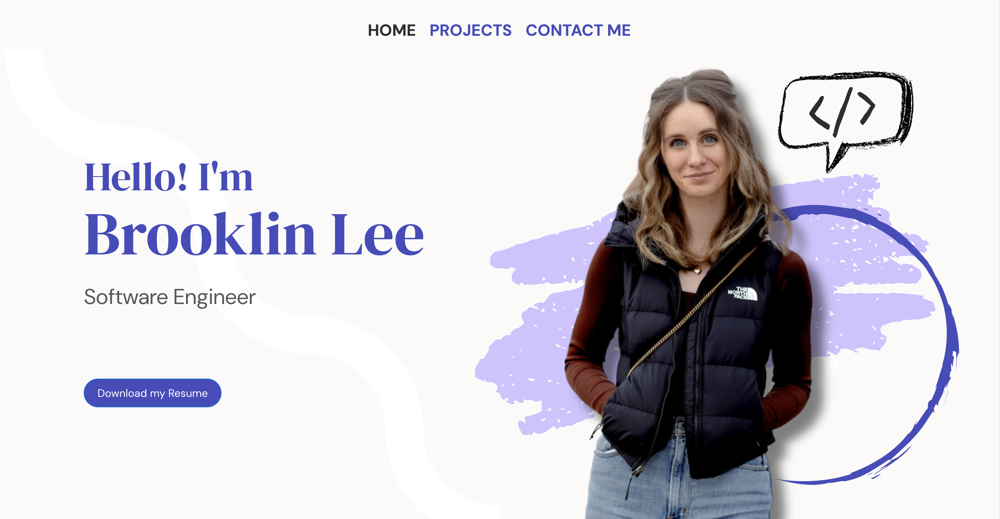

# Brooklin Lee's Portfolio Website



# Visit the Deployed Portfolio Application by clicking [HERE](https://brooklin-lee-portfolio.netlify.app/)

## About Me

Hello! My name is Brooklin Lee, and I am a recently graduated Software Engineer with a background in entrepreneurship and social media management. I recently completed an intensive 12-week Software Engineering Immersive program at General Assembly, where I honed my skills in JavaScript, HTML, CSS, Python, React, and various frameworks and services such as Node.js and Express.js.

During this program, I had the amazing opportunity to build a range of projects with a wide variety of languages and frameworks. I want to show them off to you!

One of the most satisfying things in life is being able to look at all of the projects that you have created and see how you have improved over time. I am excited to have this portfolio to look back on projects that I am proud of and to be able to add new projects to it in the future as I continuously hone my coding abilities.

Take a look at my portfolio today, and email me if you have any ideas for projects that I can build in the future!

## Skills & Technologies Used ⚙️
- Git/GitHub
- Responsive Web Design
- Visual Studio Code
- HTML5/CSS3
- JavaScript
- React
- EmailJS


## Attributions

### Email Sending
- Send email directly through your code with [EmailJS](https://www.emailjs.com/).

### React + Vite Template
This project is built upon the React + Vite template provided by the following resources:

- [React + Vite Template](https://github.com/vitejs/create-vite)
- [Vite](https://vitejs.dev/)
- [Vite React Plugin](https://github.com/vitejs/vite-plugin-react)
- [Vite React SWC Plugin](https://github.com/vitejs/vite-plugin-react-swc)

The initial project setup was created using the following command:
```
npm create vite@latest my-new-app -- --template react
```

